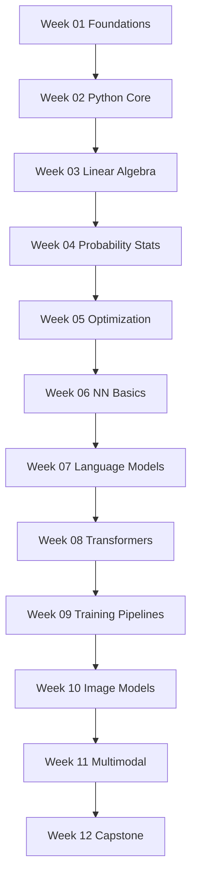

# 90-Day Generative AI Guidebook + Execution Plan

Goal: move from zero AI background to building and evaluating small text and image generative models from first principles.

Duration: 12 weeks (90 core tasks), designed for consistent weekly execution.

## How to Use This Guidebook
- Follow one week at a time in sequence.
- Complete every week's `README.md` and keep outputs inside that week folder.
- Spend 8-15 focused hours per week (or scale up if full-time).
- Use the end-of-week gate before moving forward.

## Repository Structure
- `plans/90-day-genai-roadmap.md` (this master guide)
- `week-01-foundations`
- `week-02-python-core`
- `week-03-linear-algebra`
- `week-04-probability-stats`
- `week-05-optimization`
- `week-06-nn-basics`
- `week-07-language-models`
- `week-08-transformers`
- `week-09-training-pipelines`
- `week-10-image-models`
- `week-11-multimodal`
- `week-12-capstone`

Each week contains:
- `README.md` with mission, tasks, blueprint, and quality gates
- `notes/` for theory summaries and retrospectives
- `code/` for implementations and experiments
- `artifacts/` for plots, logs, samples, and checkpoints

## Learning Arc (What Changes Over 90 Days)
- Weeks 1-2: coding fluency and data preprocessing foundations
- Weeks 3-5: math and optimization intuition for model learning
- Weeks 6-8: core neural architectures and transformer fundamentals
- Weeks 9-11: reliable training systems, image generation, multimodal alignment
- Week 12: capstone integration and final technical reporting

## Weekly Index
- Week 01: [`week-01-foundations/README.md`](../week-01-foundations/README.md)
- Week 02: [`week-02-python-core/README.md`](../week-02-python-core/README.md)
- Week 03: [`week-03-linear-algebra/README.md`](../week-03-linear-algebra/README.md)
- Week 04: [`week-04-probability-stats/README.md`](../week-04-probability-stats/README.md)
- Week 05: [`week-05-optimization/README.md`](../week-05-optimization/README.md)
- Week 06: [`week-06-nn-basics/README.md`](../week-06-nn-basics/README.md)
- Week 07: [`week-07-language-models/README.md`](../week-07-language-models/README.md)
- Week 08: [`week-08-transformers/README.md`](../week-08-transformers/README.md)
- Week 09: [`week-09-training-pipelines/README.md`](../week-09-training-pipelines/README.md)
- Week 10: [`week-10-image-models/README.md`](../week-10-image-models/README.md)
- Week 11: [`week-11-multimodal/README.md`](../week-11-multimodal/README.md)
- Week 12: [`week-12-capstone/README.md`](../week-12-capstone/README.md)

## Master Completion Criteria
You have completed the full 90-day plan when:
- All 90 tasks are checked off across weeks.
- Every week has non-empty `notes/`, `code/`, and `artifacts/` outputs.
- At least one text generator and one image generator run end-to-end.
- You can present results, limitations, and next-step improvements clearly.

## Progress Tracker
- Week 01: [ ]
- Week 02: [ ]
- Week 03: [ ]
- Week 04: [ ]
- Week 05: [ ]
- Week 06: [ ]
- Week 07: [ ]
- Week 08: [ ]
- Week 09: [ ]
- Week 10: [ ]
- Week 11: [ ]
- Week 12: [ ]

## Learning Progression Diagram

## Daily Guide Format
- Each week includes `days/day-01.md` through `days/day-07.md`.
- Every day file contains: 5-15 minute reading material, how-to-read notes, exact coding tasks, practice drills, and a done checklist.
- Execute the daily files directly; do not treat weekly tasks as generic guidance.
